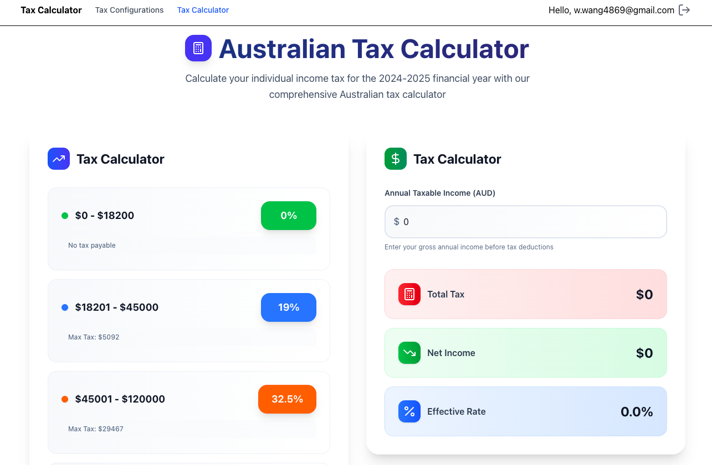
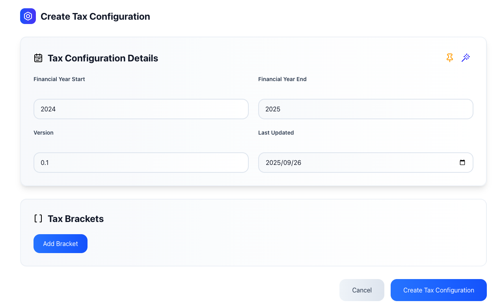
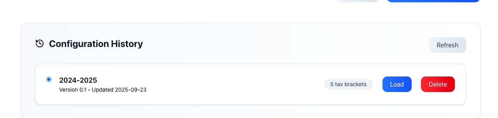

# 🇦🇺 Australian Tax Calculator

A modern, full-featured tax calculation application built with React, TypeScript, and AWS Amplify. Features real-time tax calculations, configuration management, and seamless navigation between different tax plans.


## 🌐 Live Demo & Repository

- **🚀 Live Application**: [https://taxcalculator.winoooops.com](https://taxcalculator.winoooops.com)
- **📁 GitHub Repository**: [winoooops/amplify-vite-react-australian-calculator](https://github.com/winoooops/amplify-vite-react-australian-calculator)

## ✨ Key Features

### **🧮 Tax Calculation Engine**
- **Real-time Calculations**: Instant Australian tax bracket calculations
- **Visual Tax Breakdown**: Interactive charts showing tax distribution across brackets
- **Multi-bracket Support**: Handles complex progressive tax structures
- **Instant Results**: See tax calculations update as you type



### **⚙️ Tax Configuration Management**
- **Multiple Tax Plans**: Create and manage different tax configurations
- **Active Plan Switching**: Easily switch between different tax configurations
- **Financial Year Settings**: Configure tax brackets for specific financial years
- **Form Validation**: React Hook Form (RHF) for robust form handling and validation



### **📋 Configuration History**
- **Configuration Management**: View and manage tax plan history
- **Plan Switching**: Toggle between different active configurations
- **Data Persistence**: Configurations stored and retrieved from backend



### **🎨 User Interface**
- **Modern Design**: Clean, professional interface with Tailwind CSS
- **Responsive Layout**: Works seamlessly on desktop and mobile
- **Interactive Elements**: Smooth transitions and hover effects
- **Toast Notifications**: User feedback with React Toastify
- **Skeleton Loading**: Improved perceived performance during data loading

## 🏗️ Technical Architecture

### **Frontend Stack:**
- **⚛️ React 18** - Latest React with hooks and concurrent features
- **📦 TypeScript** - Type-safe development experience
- **🎨 Tailwind CSS** - Utility-first CSS framework
- **🛣️ TanStack Router** - Type-safe routing with lazy loading
- **📝 React Hook Form** - Advanced form handling and validation
- **🔄 React Context** - State management across routes
- **🍞 React Toastify** - Notification system

### **Backend & Cloud:**
- **☁️ AWS Amplify** - Full-stack development platform
- **📊 AWS AppSync** - Managed GraphQL API
- **💾 Amazon DynamoDB** - NoSQL database

### **Key Features Implemented:**

#### **🚀 Routing & Navigation**
- **Route-based Navigation**: Seamless switching between calculator and configuration pages
- **Context State Management**: Shared state across multiple routes using React Context
- **Lazy Loading**: Components load only when needed to improve performance

#### **📋 Tax Configuration System**
- **Dynamic Form Management**: RHF for complex form validation and state management
- **Active Tax Plan Switching**: Toggle between different tax configurations
- **CRUD Operations**: Create, read, update, delete tax configurations
- **Data Persistence**: Configurations stored in DynamoDB via GraphQL API

## 🚀 Quick Start

### Prerequisites
- Node.js 18+ and npm
- AWS Account with Amplify CLI configured

### Installation & Setup

1. **Clone the repository:**
   ```bash
   git clone https://github.com/winoooops/amplify-vite-react-australian-calculator.git
   cd amplify-vite-react-australian-calculator
   ```

2. **Install dependencies:**
   ```bash
   npm install
   ```

3. **Start local development:**
   ```bash
   npm run dev
   ```

4. **Set up AWS Amplify backend:**
   ```bash
   npx ampx sandbox
   # Deploy backend services locally
   ```

5. **Open your browser:**
   Navigate to `http://localhost:5173`

### Production Deployment

```bash
# Build optimized production bundle
npm run build

# Preview production build
npm run preview

# Deploy to AWS Amplify
npx ampx deploy
```

## 🛠️ Tech Stack

### **Frontend:**
- **⚛️ React 18** - Latest React with hooks and concurrent features
- **📦 TypeScript** - Type-safe development experience
- **🎨 Tailwind CSS** - Utility-first CSS framework
- **🛣️ TanStack Router** - Type-safe routing with lazy loading
- **📝 React Hook Form** - Advanced form handling and validation
- **🔄 React Context** - State management across routes
- **🍞 React Toastify** - Notification system
- **🎯 Lucide React** - Icon library

### **Backend & Cloud:**
- **☁️ AWS Amplify** - Full-stack development platform
- **🔐 Amazon Cognito** - Authentication and user management
- **📊 AWS AppSync** - Managed GraphQL API
- **💾 Amazon DynamoDB** - NoSQL database
- **📱 AWS Amplify UI** - Pre-built authentication components

## 📁 Project Structure

```
📦 amplify-vite-react-australian-calculator/
├── 📁 amplify/                 # AWS Amplify backend configuration
│   ├── auth/                   # Authentication resources (Cognito)
│   ├── data/                   # GraphQL API and database schema
│   └── backend.ts              # Backend configuration
├── 📁 src/                     # Frontend application code
│   ├── components/             # React components
│   │   ├── TaxCalculator/      # Tax calculation UI components
│   │   ├── TaxConfiguration/   # Tax config management components
│   │   └── Navbar.tsx          # Navigation component
│   ├── routes/                 # Route definitions
│   │   ├── taxCalculator.tsx   # Tax calculator route
│   │   ├── taxConfigs.tsx      # Tax configuration route
│   │   └── __root.tsx          # Root route with layout
│   ├── shared/                 # Shared utilities and contexts
│   │   ├── contexts/           # React contexts (TaxConfigs)
│   │   ├── hooks/              # Custom React hooks
│   │   ├── middlewares/        # API middleware functions
│   │   └── types/              # TypeScript type definitions
│   ├── App.tsx                 # Main application component
│   ├── main.tsx                # Application entry point
│   └── index.css               # Global styles
├── 📁 public/                  # Static assets
├── 📄 index.html               # HTML template
├── 📄 vite.config.ts           # Vite configuration
└── 📄 package.json             # Dependencies and scripts
```

## 🔧 Development Commands

```bash
# Development
npm run dev              # Start development server
npm run build           # Build for production
npm run preview         # Preview production build
npm run lint            # Run ESLint

# Backend Development
npx ampx sandbox        # Start local backend development
npx ampx deploy         # Deploy backend to AWS
```

## 🎯 Implemented Features

### **✅ Added Features:**
- **🚀 Routing Functionality**: Seamless navigation between tax configuration and calculator pages
- **🔄 Context State Management**: Shared local state management across multiple routes
- **⚙️ Configurable Tax Plans**: Dynamic tax configuration pages with form management
- **📝 React Hook Form (RHF)**: Advanced form handling and validation
- **🔄 Active Tax Plan Switching**: Toggle between different tax configurations
- **💀 Skeleton Components**: Application-wide loading states for improved UX
- **🍞 Toast Notifications**: User feedback system with React Toastify

### **📋 Current Capabilities:**
- **Real-time Tax Calculations**: Instant calculations based on income input
- **Multi-Configuration Support**: Create and manage different tax plans
- **Responsive Design**: Mobile-friendly interface with Tailwind CSS
- **Type-Safe Development**: Full TypeScript implementation
- **Modern React Patterns**: Hooks, Context, and Suspense usage

## 🚨 Known Issues & Improvements Needed

### **🔴 Critical Issues:**
- **⚠️ Authentication System**: Not fully integrated (UI components exist but backend integration incomplete)
- **⚠️ Amplify SDK Constraints**: Official SDK has poor support for custom backend middleware
- **⚠️ CRUD Operations**: Still using frontend client objects, exposing unnecessary logic

### **🟡 Enhancement Opportunities:**
- **💡 Tooltip Integration**: Need to add tooltips throughout the interface
- **🎨 Animation Effects**: UI animations could be enhanced (time constraints)
- **🎯 Input Styling**: Number inputs need refinement to match template design
- **📏 Code Quality**: ESLint should have been added earlier in development
- **🔐 Authentication UI**: OAuth components exist but need full backend integration

### **🔵 Future Enhancements:**
- **Complete Authentication**: Full OAuth integration with proper permission management
- **Backend Middleware**: Custom API middleware for better separation of concerns
- **Enhanced UI/UX**: Additional animations and micro-interactions
- **Input Validation**: More robust form validation and error handling
- **Code Standards**: Consistent linting and code formatting

## 📚 Additional Resources

- 🏗️ **[Contributing Guide](./CONTRIBUTING.md)** - Development guidelines and best practices
- 📖 **[Performance Optimization Guide](./docs/performance-optimization-guide.md)** - Technical performance documentation
- 🎯 **[Interview Preparation](./docs/interview-prep-web-performance.md)** - Web performance concepts for interviews

## 🔐 Security

- **AWS Integration**: Secure backend services with proper IAM roles
- **HTTPS Enforcement**: Secure connections in production deployment
- **Data Protection**: Encrypted data storage with AWS services

## 📄 License

This project is licensed under the MIT-0 License. See the [LICENSE](./LICENSE) file for details.

## 🤝 Contributing

We welcome contributions! Please see our [Contributing Guide](./CONTRIBUTING.md) for details on:

- Development setup and environment configuration
- Code standards and best practices
- Feature implementation guidelines
- Security and authentication considerations

## 📞 Support & Issues

For questions, issues, or contributions:
1. Check existing GitHub issues for similar problems
2. Review the documentation in the `/docs` folder
3. Create a new issue with detailed description and reproduction steps
4. Contact the development team through GitHub

---

**Built with modern web technologies and AWS Amplify for a robust, scalable Australian tax calculation experience.**